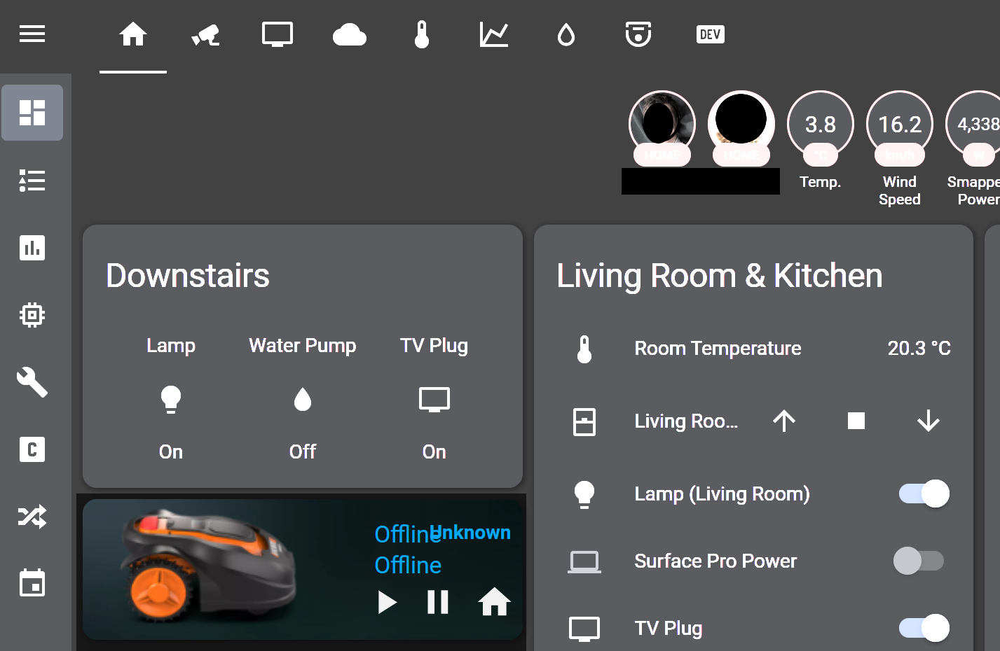

# landroid_hass_picture-element



**Prerequesites**
- Landroid Mower
- [Halandroid Integration from Barma-lej](https://github.com/Barma-lej/halandroid)
```
elements:
  - entity: sensor.landroid_mower_battery
    style:
      color: 'rgb(3, 169, 244)'
      font-weight: bold
      opacity: 1
      right: 0%
      top: 0%
      transform: 'translate(0%, 15%) scale(1, 1)'
    title: Battery
    type: state-label
  - entity: sensor.landroid_mower_status
    style:
      color: 'rgb(3, 169, 244)'
      left: 65%
      opacity: 1
      text-align: left
      top: 0%
      transform: 'translate(0%, 20%) scale(1.2, 1.2)'
    title: Status
    type: state-label
  - entity: sensor.landroid_mower_error
    style:
      color: 'rgb(3, 169, 244)'
      left: 65%
      opacity: 1
      text-align: left
      top: 0%
      transform: 'translate(0%, 80%) scale(1.2, 1.2)'
    title: Status
    type: state-label
  - icon: 'mdi:play'
    style:
      '--iron-icon-fill-color': 'rgb(250, 250, 250)'
      bottom: 15%
      left: 65%
      transform: 'translate(0%, 0%) scale(1.2, 1.2)'
    tap_action:
      action: call-service
      service: landroid_cloud.start
    title: Start
    type: icon
  - icon: 'mdi:home'
    style:
      '--iron-icon-fill-color': 'rgb(0, 0, 0)'
      bottom: 15%
      left: 70%
      transform: 'translate(260%, 0%) scale(1.2, 1.2)'
    tap_action:
      action: call-service
      service: landroid_cloud.home
    title: Stop & Return Home
    type: icon
  - icon: 'mdi:pause'
    style:
      '--iron-icon-fill-color': 'rgb(100, 100, 100)'
      bottom: 15%
      left: 57%
      transform: 'translate(260%, 0%) scale(1.2, 1.2)'
    tap_action:
      action: call-service
      service: landroid_cloud.pause
    title: Pause
    type: icon
image: /local/mower/landroid_flower3.png
type: picture-elements
```
